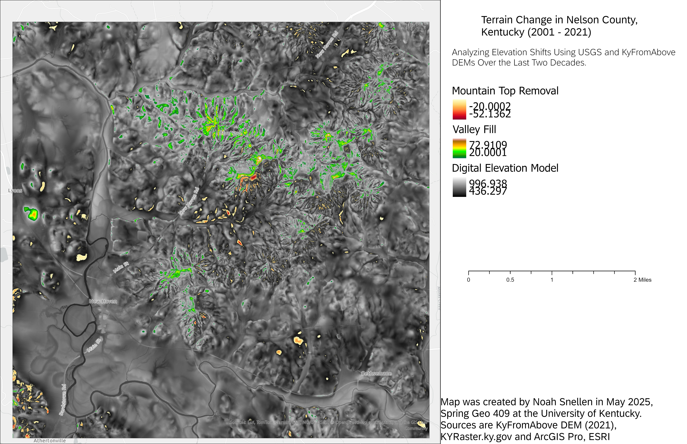

nelson-county
# Terrain Change in Nelson County, Kentucky (2001 - 2021)

## Analyzing Elevation Shifts Using USGS and KyFromAbove DEMs Over the Last Two Decades

In Nelson County, Kentucky, between 2001 and 2021, significant changes in the landscape were observed, particularly in the form of valley fill and mountain top removal. The valley fill process, which involves filling in valleys to make way for development or mining, has had a considerable impact on the natural topography of the region. Additionally, some areas experienced moderate levels of mountain top removal, a method commonly used in coal mining, which results in the alteration of mountain peaks and the surrounding terrain. These changes reflect the ongoing transformation of the landscape and highlight the dynamic relationship between human activity and the natural environment over the past two decades.

  
_Terrian Change using DEM and Mountain Top Removal, as well as Valley Fill._

Map was created by Noah Snellen in May 2025, Spring Geo 409 at the University of Kentucky. Sources are KyFromAbove DEM (2021), KYRaster.ky.gov and ArcGIS Pro, ESRI